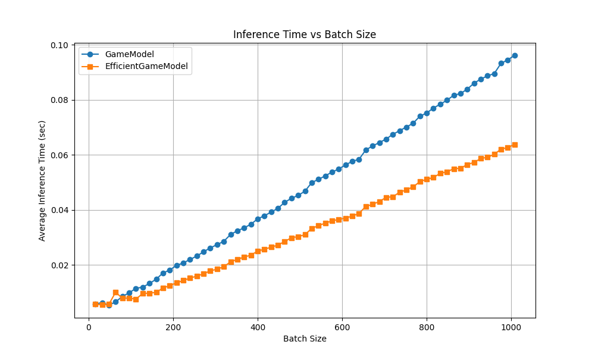

# Towards Efficient Deep Q-Learning for Sapce Invaders!

<div align="center">

<table>
  <tr>
    <td align="center">
      <br/>
      <sub><b>Efficient D3QN Gameplay</b></sub>
    </td>
    <td align="center">
      <br/>
      <sub><b>Standard D3QN Gameplay</b></sub>
    </td>
  </tr>
</table>

</div>

## Overview
This repository is a resource-conscious reinforcement learning framework designed to train Deep Q-Network (DQN) agents for Atari games—specifically Space Invaders—on consumer-grade hardware. Traditional DQN implementations often demand millions of frames and substantial computational resources, placing them out of reach for individuals or small labs. This project explores architectural optimizations and training strategies that reduce compute and memory restrictions while retaining favorable performance.

The framework includes:
- A modular and lightweight training pipeline compatible with most Atari environments under `ALE-Py`,
- Architecture optimizations for low FLOPs and memory use,
- A GUI runner for real-time performance demos and video recording,
- Pretrained weights for games that have been efficiently "solved".

## Method
Typically, DQN models would be trained for tens of millions of frames which is feasible mainly for institutions and organizations with sufficient computing resources. Using consumer grade GPUs, the training time can often take days before a proper model could be trained. In face of this, this repository attempts to train modified DQN on a compute strict budget while accomplishing favorable performance. 

Specifically, I leverage modifications of the CNN backbone and splitting the fully connected layers into value and action streams. In addition, I choose to skip 8 frames each step rather than 4, trading potential performance ceiling for more iterations. Finally, I reset the model's FC layers every $2\times 10^5$ transitions, in accordance with the paper on [Primacy Bias](https://proceedings.mlr.press/v162/nikishin22a/nikishin22a.pdf), to mitgate overfitting on previous experiences.

### Runtime Comparison
The modified D3QN model is compared against standard D3QN model to demonstrate the efficiency gains from CNN modifications.

<p align="center">
  
</p>

The modifications from the CNN's backbone provide minor advantage in handling larger batches as seen from the comparison. The Efficient D3QN (EDQ3N) is able handle batch sizes of 256 roughly 31.47% faster than standard D3QN on same batches. This allowed EDQ3N to train on slightly more batches per iteration without significantly increasing computation time. Across comparison in resolution and number of stacked frmaes, EDQ3N demonstrate similar advantages but arguably, the benefits are not effective unless resolution goes beyond (84, 84) which is impractical.

<p align="center">
  
  
</p>

### Performance results
<p align="center">
      
</p>
The modification to the DQN structure along with the layer reinitialization allowed ED3QN to reach higher performance ceiling in the same number of episodes. As a result, ED3QN was able to score more points than its counter part. As seen from the graph, despite periodically resetting the network's fully connected layers, ED3QN was able to reach higher performance ceiling in the same span of time. In comparison, D3QN remained stagnate and oscillated between 3 and 5 rewards per step. Comparing both models on 100 lives, ED3QN was able to score 57% more points than its counter part:
<p align="center">
      
</p>

Given the time, financial, and computing constraints, I was not able to explore this further or train both models to convergence across the more standard 10M frames. However, ED3QN's episodic reward indicates it would've continued improving across episodes. In the future, I hope to expand on this repository to train the models longer and on a wider selection of games when I have more computing resources.

## Installation
1. Clone the repository:
```bash
git clone https://github.com/CodeKnight314/GamePlay.git
cd GamePlay
```

2. Install required dependencies:
```bash
pip install -r requirements.txt
```

3. Verify installation by running help:
```bash
python3 -m src.main --help
```

## Usage

### Training Mode

Train RL agents on Atari games using the following command structure:

```bash
python3 -m src.main game --id <game> --c <config_path> --o <output_path> --mode train [options]
```

**Required arguments:**
- `--c`: Path to config file (e.g., `src/config/pong.yaml`)
- `--o`: Output path for saving model/weights

**Optional arguments:**
- `--id`: Game choice (`pong`, `breakout`, `invaders`) - default: `pong`
- `--seed`: Random seed for reproducibility - default: `1898`
- `--num_envs`: Number of parallel environments - default: `1`
- `--w`: Path to initial weights file (for resume training)
- `--verbose`: Enable rendering and detailed logs

**Example:**
```bash
python3 -m src.main game --id pong --c src/config/pong.yaml --o models/pong_model --mode train --verbose
```

### Test Mode

Evaluate trained agents by running test episodes:

```bash
python3 -m src.main game --id <game> --c <config_path> --o <output_path> --mode test [options]
```

**Required arguments:**
- `--c`: Path to config file (e.g., `src/config/pong.yaml`)
- `--o`: Output path for saving results

**Optional arguments:**
- `--id`: Game choice (`pong`, `breakout`, `invaders`) - default: `pong`
- `--w`: Path to trained weights file (required for meaningful testing)
- `--num_episodes`: Number of test episodes to run - default: `1`
- `--verbose`: Enable rendering during test episodes

**Example:**
```bash
python3 -m src.main game --id pong --c src/config/pong.yaml --o test_results --mode test --w models/trained_pong.pth --num_episodes 10 --verbose
```

### GUI Mode

Launch interactive GUI for human or AI gameplay:

```bash
python3 -m src.main gui --env <game> --c <config_path> --mode <control_mode> [options]
```

**Required arguments:**
- `--c`: Config path for Environment initialization
- `--mode`: Control mode (`AI` or `human`)

**Optional arguments:**
- `--env`: Game environment (`pong`, `breakout`, `invaders`) - default: `pong`
- `--w`: Weights file for AI mode

**Examples:**
```bash
# Human play
python3 -m src.main gui --env pong --c src/config/pong.yaml --mode human

# AI play with trained weights
python3 -m src.main gui --env pong --c src/config/pong.yaml --mode AI --w src/weights/pong_weights.pth
```
